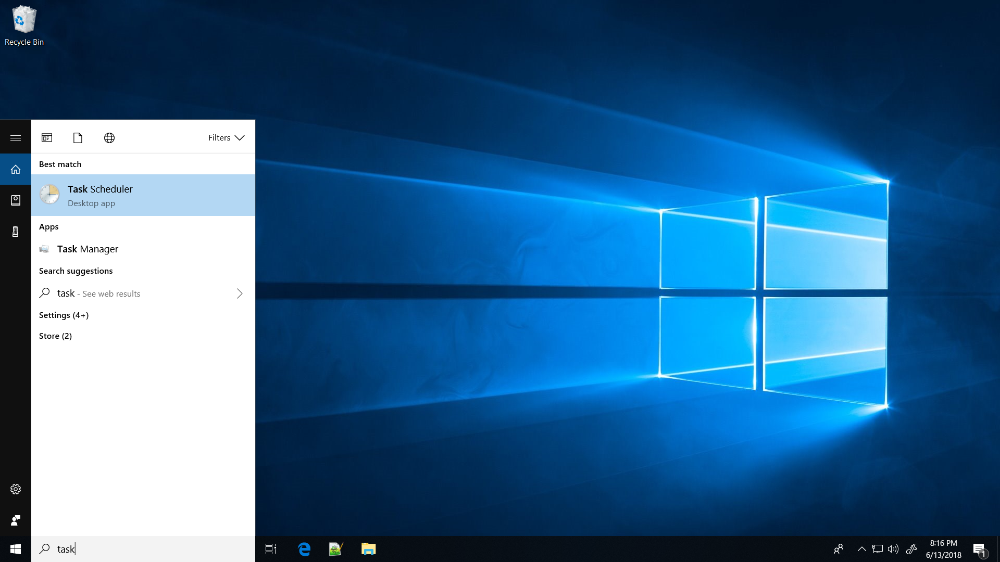
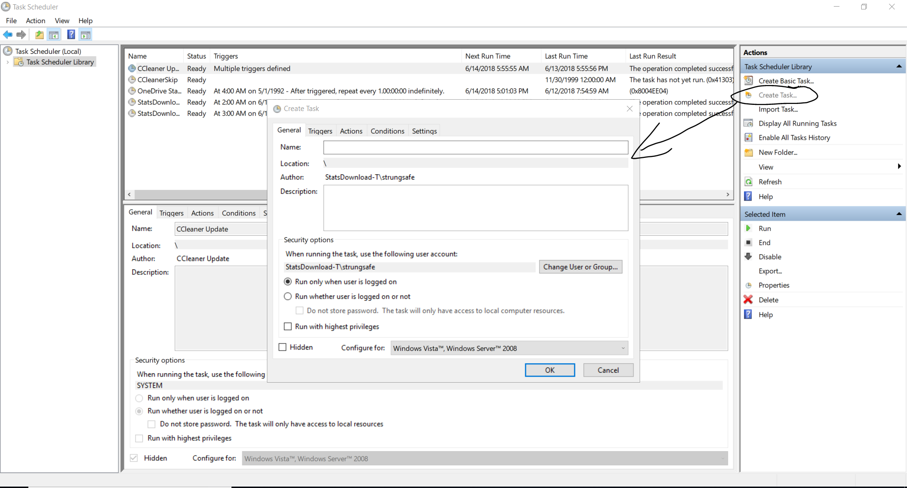
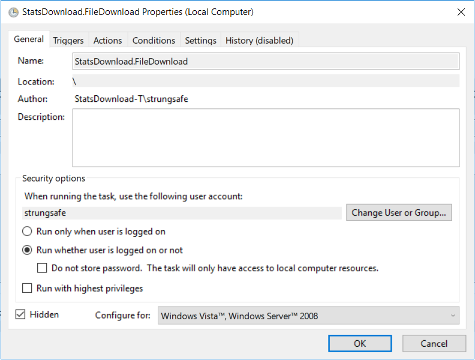
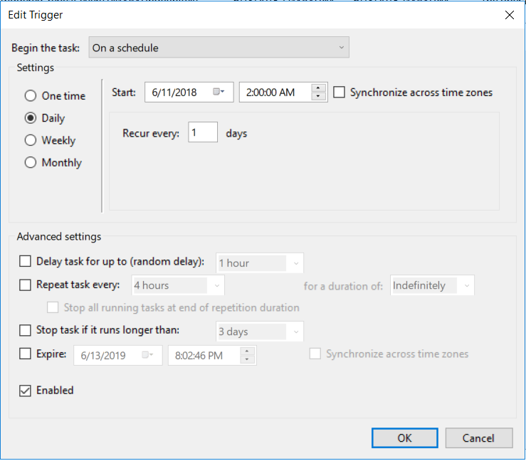
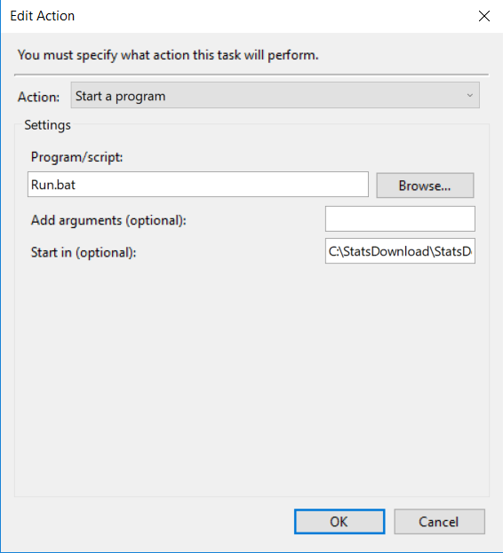

# FLDCDotNet

## Getting Started

This is a C# implementation for downloading FAH statistics on a scheduled basis, parsing and loading the statistics into a database, and parsing metadata out of a FAH user's name.

## Prerequisites

* .NET Core 2.0
* Microsoft SQL Server 2017

## Installing on Windows

1. Place FileDownload and StatsUpload console applications in the desired directory
2. [Update applications configuration file](SettingsConfiguration.md)
3. Navigate to FLDCDotNet/Database
	1. Run the schema script to create a database (update path to database)
	2. Run the stored procedure script against the database
4. Create a task for each application
	1. 
	2. 
	3. 
	4. 
	5. 
5. Use a batch script calling the appropriate application

```
dotnet StatsDownload.FileDownload.Console.dll >> Log.txt
dotnet StatsDownload.StatsUpload.Console.dll >> Log.txt
```

### Applications

1. StatsDownload.TestHarness
	* This is a windows forms application meant to provide a GUI interface to the file download and stats upload processes for rapid testing
2. StatsDownload.FileServer.TestHarness
	* This is a WCF application meant to provide a test server for the file download i.e. for mocking Stanford's server
3. StatsDownload.FileDownload.Console
	* This is a console application meant to be executed via command line or task scheduler and will execute only the file download portion of the stats download process
4. StatsDownload.StatsUpload.Console
	* This is a console application meant to be executed via command line or task scheduler and will execute only the stats upload portion of the stats download process

## Running the tests

### Unit Tests

1. Use ReSharper from Visual Studios
2. nunit-console {path-to-assembly}

### Integration Tests

1. Use the FileServer.TestHarness for integration tests
	* Several endpoints exist for testing various scenarios
2. Update FileServer.TestHarness settings
	* [FileServer Test Harness Settings](FileServer.TestHarness.SettingsConfiguration.md)

## Deployment

### App Hardware Requirements

* HDD 120GB+
* i5 Intel / Ryzen 5 AMD
* 16 GB

### DB Hardware Requirements

* SSD 120GB+
* i5 Intel / Ryzen 5 AMD
* 16 GB

## Built With

* Visual Studio 2017
* Microsoft SQL Server 2017
* ReSharper

## License

This project is licensed under the MIT License - see the [LICENSE](../LICENSE) file for details

## Acknowledgments

* SharpZipLib